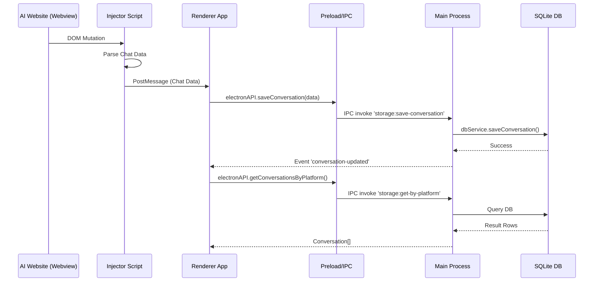

# 架构与数据流向文档 (Architecture & Data Flow)

本文档详细说明了 Electron AI Browser 的数据流向、关键数据结构的变化，并提出了垂直搜索引擎模块的设计方案。

## 1. 数据流向概览 (Data Flow Overview)

应用采用标准的 Electron 进程间通信 (IPC) 架构。数据主要从渲染进程 (Renderer) 流向主进程 (Main)，最终存储在 SQLite 数据库中。

### 核心流程

1.  **数据采集 (Renderer/Preload)**:
    *   用户在 [BrowserView](file:///d:/AntiGravityProject/src/renderer/components/BrowserView.tsx#13-173) (嵌入的 WebView) 中与 AI 聊天。
    *   注入脚本 (`injector.js`) 监听 DOM 变化，提取聊天记录。
    *   提取的数据被封装为 [Conversation](file:///d:/AntiGravityProject/src/preload/types.ts#15-25) 和 [Message](file:///d:/AntiGravityProject/src/preload/types.ts#5-14) 对象。
    *   通过 `window.electronAPI.saveConversation` 发送给主进程。

2.  **IPC 通信 (Bridge)**:
    *   **Preload ([src/preload/index.ts](file:///d:/AntiGravityProject/src/preload/index.ts))**: `contextBridge` 暴露安全的 API。将调用转发为 `ipcRenderer.invoke('storage:save-conversation', data)`。
    *   **Main ([src/main/main.ts](file:///d:/AntiGravityProject/src/main/main.ts))**: `ipcMain.handle('storage:save-conversation', ...)` 接收请求。

3.  **数据持久化 (Main/Database)**:
    *   主进程调用 `dbService.saveConversation(data)`。
    *   **Database Service ([src/main/services/database.ts](file:///d:/AntiGravityProject/src/main/services/database.ts))**:
        *   解析 [Conversation](file:///d:/AntiGravityProject/src/preload/types.ts#15-25) 对象。
        *   使用事务 (Transaction) 将数据写入 `conversations_v2` 和 `messages_v2` 表。
        *   同时更新 FTS5 全文索引表 `messages_fts_v2`。

4.  **UI 更新 (Feedback)**:
    *   保存成功后，主进程通过 `conversation-updated` 事件通知所有窗口。
    *   渲染进程监听此事件，重新获取列表并更新 UI。



## 2. 数据结构演变 (Data Structure Evolution)

数据在传输过程中保持一致，主要由 [src/preload/types.ts](file:///d:/AntiGravityProject/src/preload/types.ts) 定义。

### 2.1 核心接口

**Message (消息)**
```typescript
interface Message {
    messageId: string;  // 唯一 ID (UUID)
    sender: 'user' | 'AI'; // 发送者
    content: string;    // 消息内容
    thinking?: string;  // AI 思考过程 (可选)
    position: number;   // 排序位置
    createdAt: string;  // 创建时间 (ISO String)
    updatedAt: string;  // 更新时间
}
```

**Conversation (会话)**
```typescript
interface Conversation {
    id: string;         // 会话 ID
    platform: string;   // 平台 (e.g., 'chatgpt', 'copilot')
    title: string;      // 会话标题
    messages: Message[];// 消息列表
    url: string;        // 原始 URL
    createdAt: string;
    updatedAt: string;
}
```

### 2.2 数据库存储结构 (SQLite)

在数据库中，对象被拆分为关系型表结构：

*   **conversations_v2**: 存储会话元数据 ([id](file:///d:/AntiGravityProject/src/renderer/components/BrowserView.tsx#92-96), `platform`, `title`, `url`, `created_at`, `updated_at`)。
*   **messages_v2**: 存储消息详情，通过 `conversation_id` 关联父会话。