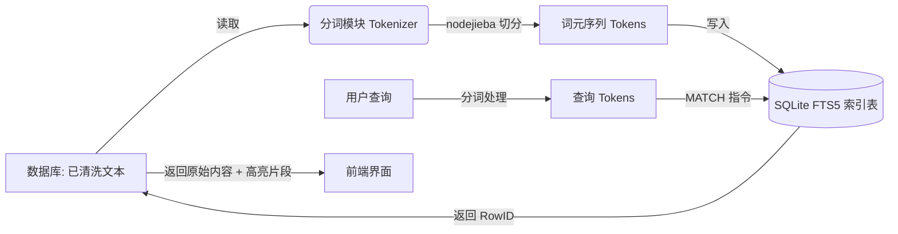

# 垂直搜索引擎完整设计方案 (Vertical Search Engine Design Scheme)

本方案旨在为 Electron AI Browser 构建一个完整的垂直搜索引擎，专注于 AI 聊天记录的深度检索。根据现有架构，**数据库中已存储了预处理过的纯文本**，因此本方案的核心在于**中文分词 (Segmentation)** 与 **索引构建 (Indexing)**。

## 1. 数据收集与现状 (Data Collection & Current State)

### 现状分析
*   **数据源**: 用户与 AI (ChatGPT, Copilot）等ai 的对话。
*   **当前状态**: 数据已通过注入脚本捕获，并经过了基础清洗（去除 HTML 标签、噪声），以**纯文本**形式存储在 SQLite 的 `messages_v2` 表中。
*   **痛点**: 现有的 FTS5 搜索仅支持简单的子串匹配，无法处理中文语义分词（例如搜 "搜索引擎" 无法匹配 "搜索的引擎"）。

### 流程设计
我们不需要重新设计爬虫，而是基于现有数据流增加一个**分词处理环节**。

1.  **实时流**: 新消息入库 -> 触发分词 -> 更新索引。
2.  **存量流**: 遍历历史消息 -> 批量分词 -> 重建索引。

---

## 2. 核心模块：中文分词 (Segmentation Module)

这是本方案的核心。我们需要将数据库中已有的“干净文本”转换为“可索引的词元序列”。

### 2.1 技术选型
*   **分词算法**: 结合 **HMM (隐马尔可夫模型)** 和 **字典匹配**。
*   **工具库**: `segment` (纯 JS，易部署)。
*   **模式**: 使用 **搜索引擎模式 (Search Mode)**，将长词切分为所有可能的短词，提高召回率。
    *   *原文*: "垂直搜索引擎"
    *   *精确模式*: ["垂直", "搜索引擎"]
    *   *搜索模式*: ["垂直", "搜索", "引擎", "搜索引擎"] (推荐)

### 2.2 处理流程 (Pipeline)

```typescript
import nodejieba from 'nodejieba';

class Tokenizer {
    /**
     * 输入: 数据库中的 clean_content (e.g., "React是前端框架")
     * 输出: 空格分隔的 tokens (e.g., "React 是 前端 框架")
     */
    public tokenize(text: string): string {
        if (!text) return '';

        // Remove HTML tags and common markdown symbols
        let cleanText = text.replace(/<[^>]+>/g, ' ');
        cleanText = cleanText.replace(/[*#`_~\[\]()]/g, ' ');

        // Segment
        const result = this.segment.doSegment(cleanText, {
            simple: true // Return string array
        });

        // Filter and Join
        return result
            .filter((word: string) => {
                const w = word.trim();
                // Filter out stop words and single punctuation
                return w.length > 0 && !this.stopWords.has(w.toLowerCase()) && !/^[\p{P}\p{S}]$/u.test(w);
            })
            .map((word: string) => word.toLowerCase()) // Normalize to lowercase for index
            .join(' ');
    }
}
```

---

## 3. 建立索引模块 (Indexing Module)

利用 SQLite 的 **FTS5 (Full-Text Search 5)** 扩展，对分词后的结果建立倒排索引。

### 3.1 索引表结构
我们需要创建一个“影子表”来存储分词结果。

```sql
-- FTS5 虚拟表
-- content='messages_v2': 这是一个外部内容表 (External Content Table)
-- 这意味着 FTS 表不存储原始文本，只存储索引，节省空间
CREATE VIRTUAL TABLE messages_fts_index USING fts5(
    tokens,               -- 存储分词后的结果
    content='messages_v2', -- 关联原始数据表
    content_rowid='id'     -- 关联主键
);
```

### 3.2 索引维护策略

**A. 新增数据 (Real-time)**
在应用层 (Main Process) 写入新消息后，立即进行分词并更新索引。

```typescript
// 伪代码
async function saveMessage(msg) {
    // 1. 存入原始表 (已有逻辑)
    await db.run('INSERT INTO messages_v2 (content) VALUES (?)', [msg.content]);
    
    // 2. 分词
    const tokens = tokenizer.tokenize(msg.content);
    
    // 3. 存入索引表
    await db.run('INSERT INTO messages_fts_index (rowid, tokens) VALUES (last_insert_rowid(), ?)', [tokens]);
}
```

---

## 4. 查询交互界面模块 (Query Interface Module)

本模块负责接收前端的结构化查询请求，并在后端执行复杂的搜索逻辑。

### 4.1 查询对象定义 (SearchQuery Interface)

为了支持多维度过滤，我们定义如下结构化的查询接口：

```typescript
interface SearchQuery {
    keyword: string;           // 搜索关键词
    filters?: {
        platform?: string[];   // 平台过滤 (e.g., ['chatgpt'])
        dateRange?: {          // 时间范围
            start: string;
            end: string;
        };
        sender?: 'user' | 'AI';// 发送者过滤
    };
    options?: {
        limit: number;         // 分页限制
        offset: number;        // 分页偏移
        highlight: boolean;    // 是否开启高亮
    };
}
```

### 4.2 数据库服务扩展 (Database Service Extension)

在 [DatabaseService](file:///d:/AntiGravityProject/src/main/services/database.ts#7-245) 中扩展 `advancedSearch` 方法来处理上述查询对象。

```typescript
class DatabaseService {
    // ... existing methods ...

  /**
   * Advanced Search with Tokenization and Filters
   * 高级搜索，支持分词和过滤
   */
  public advancedSearch(query: any) {
    // 1. Tokenize
    // 1. 分词
    const tokens = tokenizerService.tokenize(query.keyword);
    if (!tokens) return [];

    // 通过给每个词元添加通配符 (*) 支持前缀搜索
    // 为了更灵活的匹配，已将 AND 改为 OR
    const matchQuery = tokens.split(' ')
      .map(t => `\"${t}\"*`)   // 为前缀匹配添加 *
      .join(' OR ');  // 使用 OR 而非 AND 进行部分匹配

    // 2. 构建 SQL
    let sql = `
      SELECT
        m.id, m.content, m.thinking, m.created_at, m.sender,
        c.platform, c.title, c.id as conversation_id
      FROM messages_fts_index fts
      JOIN messages_v2 m ON m.rowid = fts.rowid
      JOIN conversations_v2 c ON m.conversation_id = c.id
      WHERE messages_fts_index MATCH @matchQuery
    `;
    const params: any = { matchQuery };

    // 3. 过滤器
    if (query.filters?.platform?.length) {
      // better-sqlite3 具名参数难以安全地注入数组，因此使用手动占位符
      sql += ` AND c.platform IN (${query.filters.platform.map((p: string) => `'${p}'`).join(',')})`;
    }

    if (query.filters?.dateRange) {
      sql += ` AND m.created_at BETWEEN @start AND @end`;
      params.start = query.filters.dateRange.start;
      params.end = query.filters.dateRange.end;
    }

    if (query.filters?.sender) {
      sql += ` AND m.sender = @sender`;
      params.sender = query.filters.sender;
    }

    // 4. 分页
    sql += ` ORDER BY m.created_at DESC LIMIT @limit OFFSET @offset`;
    params.limit = query.options?.limit || 20;
    params.offset = query.options?.offset || 0;

    try {
      const results = this.db.prepare(sql).all(params) as any[];

      // 5. 手动生成摘要
      // 将搜索查询的关键词字符串按空格分割成一个数组，用于后续生成摘要时高亮显示。
      const tokenList = tokens.split(' ');
      // 遍历查询结果集中的每一行（即每一条消息）。
      return results.map(row => {
        // 为当前消息的内容 (row.content) 生成一个摘要。
        // generateSnippet 方法会根据 tokenList 中的关键词，在 content 中提取相关片段，并进行高亮处理。
        // maxLength 参数限制了摘要的最大长度为 150 个字符。
        const snippet = this.generateSnippet(row.content, tokenList, 150);
        // 返回一个新的对象，该对象包含原始行数据 (row) 的所有属性，并额外添加一个名为 'snippet' 的属性，其值为刚刚生成的摘要。
        return { ...row, snippet };
      });
    } catch (error) {
      console.error('Search failed:', error); // 搜索失败
      return [];
    }
  }
}
```

### 4.3 结果展示
*   **高亮 (Highlighting)**: 使用 FTS5 自带的 `snippet` 函数返回带 HTML 标签的片段。
*   **前端渲染**: 解析 `<b>` 标签，应用高亮样式 (如黄色背景)。

---

## 总结：修正后的数据流


